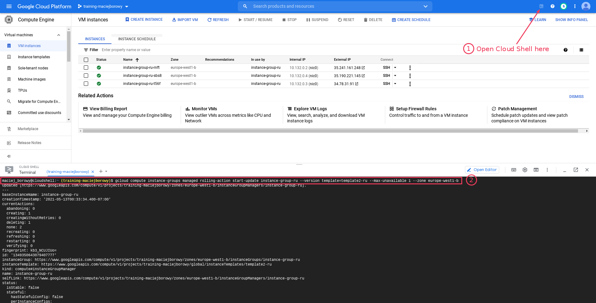
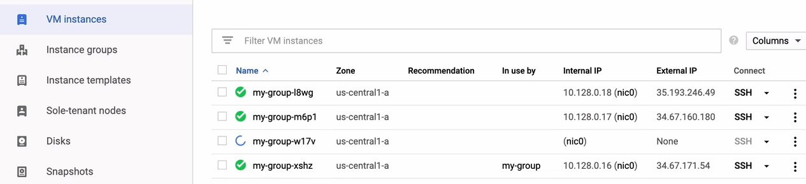
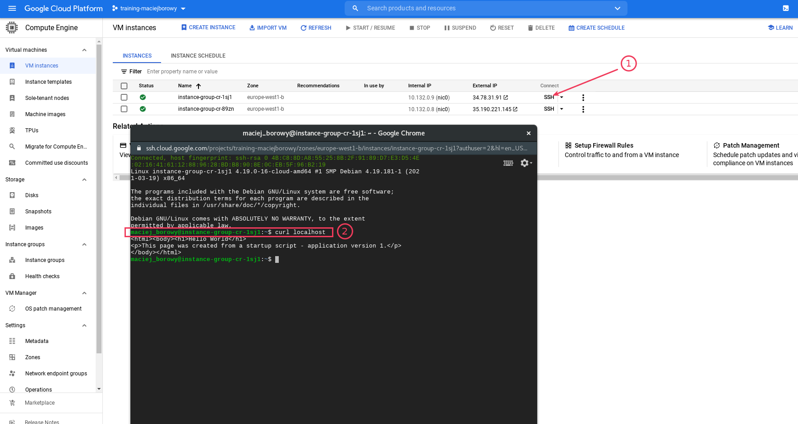

# Managed Instance Group - Rolling Updates and Canary Releases

## LAB Overview

In this lab, you will create Managed Instance Groups which will be updated in two ways. First one will use Rolling Update technique to update its instances. Second one will use Canary Release approach, to update part of the instances, and then the rest.

## Step 1. Creating `template1-ru` for initial Managed Instance Group

1. Open GCP Console and go to section `Compute`. Go to _Instance templates_ menu and create new template.

2. Create `template1-ru` for the initial Managed Instance Group Creation:

```
Name:                 template1-ru
Machine Type:         e2-micro

Firewall settings
Allow HTTP traffic:   mark checkbox
Allow HTTPs traffic   mark checkbox
```

3. Before creating the instance, we need to change base image from which instance will boot. To do this, in `Boot disk` configuration select change and change operating system image to Debian with version Debian GNU/Linux 9 (stretch):


4. Select `Create` to create template.

5. After template is created, create new Managed Instance Group (under _Instance groups_ menu) using `template1-ru`:

```
Name:                           instance-group-ru
Location:                       Single zone
Region:                         europe-west1
Zone:                           euorpe-west1-b
Instance template:              template1-ru
Number of instances:            3
Autoscaling mode:               Don't autoscale
Minimum number of instances:    1
Maximum number of instances:    3
```

## Step 2. Creating `template2-ru` for updating Managed Instance Group.

1. Create new template `template2-ru` which will be used for rolling update.

```
Name:                 template2-ru
Machine Type:         e2-micro

Firewall settings
Allow HTTP traffic:   mark checkbox
Allow HTTPs traffic   mark checkbox
```

2. In this case, leave default boot image as it is (Debian 10).

3. Select `Create` to create template.

## Step 3. Perform update on Managed Instance Group.

1. To perform update on the existing Managed Instance Group to `template2-ru`, run following gcloud command (on _Cloud Shell_):

```bash
gcloud compute instance-groups managed rolling-action start-update instance-group-ru --version template=template2-ru --max-unavailable 1 --zone europe-west1-b
```



2. Go to `VM instances` view to see how instances are removed/added during update.



3. After update finishes, go to any of the Compute Engine instances and verfiy that boot image was updated.

## Step 4. Cleanup resources

1. Before going next, delete `instance-group-ru` Managed Instance Group from the groups list in `Instance groups`.

2. Delete templates from the `Instance templates` view.

## Step 4. Creating `template1-cr`

In the next part of the lab, you will create templates for canary releases.

1. Create new template `template1-cr` which will be used to create initial version of Managed Group Instance.

```
Name:                 template1-cr
Machine Type:         e2-micro

Firewall settings
Allow HTTP traffic:   mark checkbox
Allow HTTPs traffic   mark checkbox
```

2. Fill startup script with following script:

```
#! /bin/bash
apt update
apt -y install apache2
cat <<EOF > /var/www/html/index.html
<html><body><h1>Hello World</h1>
<p>This page was created from a startup script - application version 1.</p>
</body></html>
EOF
```

3. Select `Create` to create template.

## Step 5. Creating another Managed Instance Group using `template1-cr`.

1. Similarly as before, create new Managed Instance Group with following configuration:

```
Name:                           instance-group-cr
Location:                       Single zone
Region:                         europe-west1
Zone:                           euorpe-west1-b
Instance template:              template1-cr
Number of instances:            2
Autoscaling mode:               Don't autoscale
Minimum number of instances:    1
Maximum number of instances:    2
```

2. Check that both of the instance have same `index.html` deployed. Use SSH to login to VM and check response on the localhost using `curl localhost` and on the other VM (`curl <OTHER_VM_INTERNAL_IP>`; use internal IP address).

   

## Step 6. Creating `template2-cr`

1. Create new template `template2-cr` which will be used to create initial version of Managed Group Instance.

```
Name:                 template2-cr
Machine Type:         e2-micro

Firewall settings
Allow HTTP traffic:   mark checkbox
Allow HTTPs traffic   mark checkbox
```

2. Fill startup script with following script:

```
#! /bin/bash
apt update
apt -y install apache2
cat <<EOF > /var/www/html/index.html
<html><body><h1>Hello World</h1>
<p>This page was created from a startup script - application version 2.</p>
</body></html>
EOF
```

3. Select `Create` to create template.

## Step 7. Performing canary update on the existing Managed Instance Group.

1. Run following command to start canary update only on 50% of the virtual machines from `instance-group-cr` instance group:

```
gcloud compute instance-groups managed rolling-action start-update instance-group-cr --version template=template1-cr --canary-version template=template2-cr,target-size=50% --zone europe-west1-b
```

2. Go to the `VM instances` view. You should see that one of the instances gets updated. Login via SSH to an instance and verfiy that one of the instances contains `version 1`, and second instance `version 2` of the index.html on the Apache server.

3. Perform update to the remaining instance from the group:

```bash
gcloud compute instance-groups managed rolling-action start-update instance-group-cr --version template=template2-cr --zone europe-west1-b
```

4. Verify that remaining machine was update by checking its `index.html` page.

## Step 8. Cleanup resources.

In this step you will create two new buckets. One in GCP Console, and second one using Cloud Shell.

1. Before going next, delete `instance-group-cr` Managed Instance Group from the groups list in `Instance groups`.

2. Delete templates from the `Instance templates` view.
