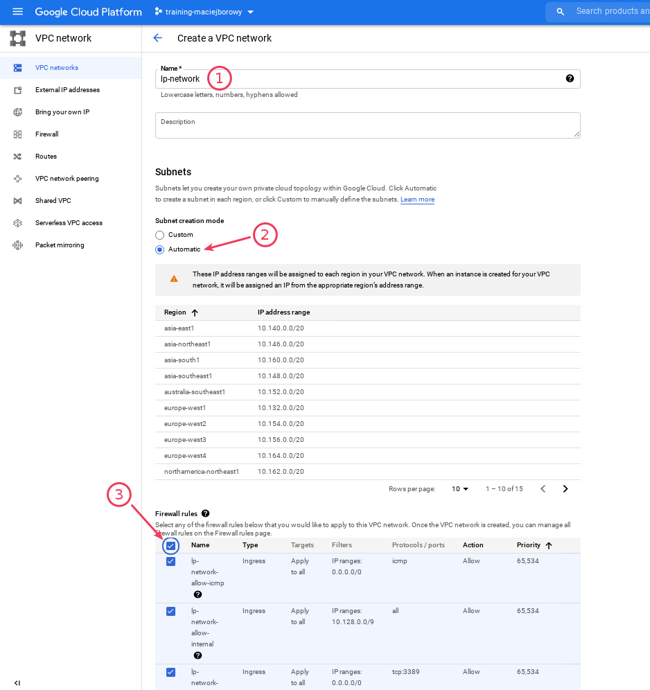
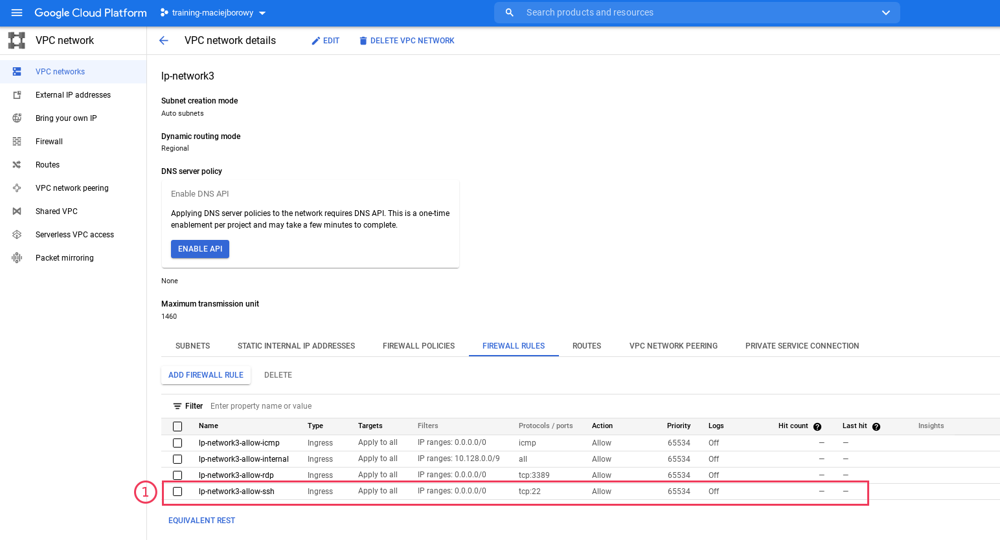
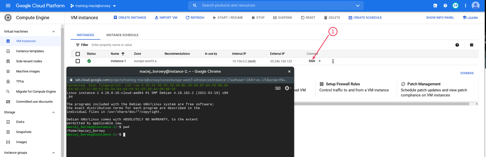
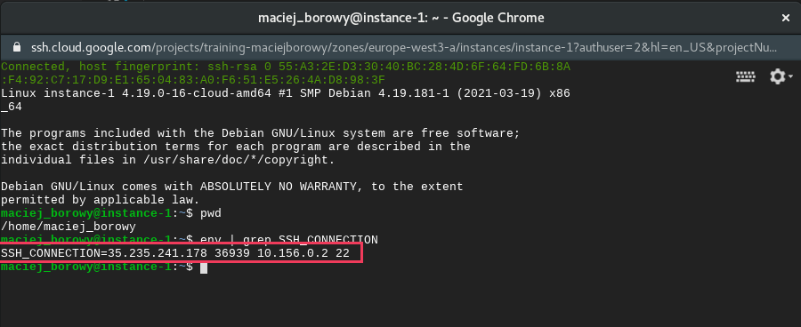
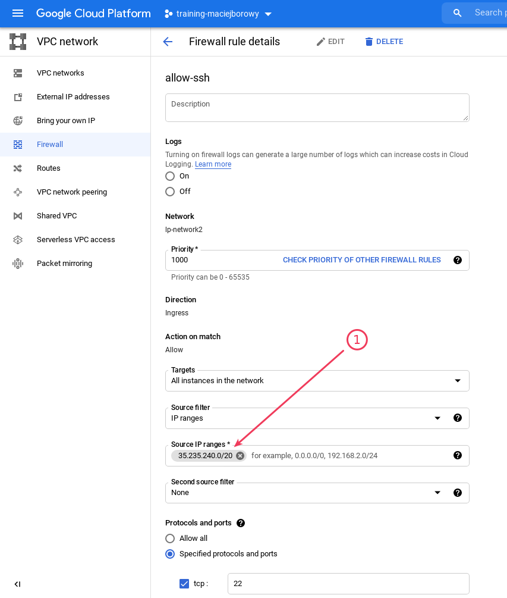

# Restrict SSH access

## LAB Overview

In this lab, you'll restrict access to your VM via SSH to work only through GCP portal.

---

1. Create a new _VPC Network_ and configure it as follows:

   - name `lp-network`
   - change _Subnet creation mode_ to _Automatic_
   - select all _Firewall rules_

   

1. Check details of your new _VPC network_. Check if there is a rule allowing SSH (`tcp:22`) for every one (`IP range: 0.0.0.0/0`)

   

1. Create a single new _VM instance_ connected to your new network

   Configure your VM instance as follows:

   - region: `europe-west3`
   - zone: `europe-west3-a`
   - Machine type: `e2-micro`
   - Networking > Network interfaces: `lp-network` (confirm by pressing `Done`)

1. Verify you can SSH into VM via the portal.

   

1. Check SSH connection details. Check the IP address range.

   ```bash
   env | grep SSH_CONNECTION
   ```

   

1. Modify network. Restrict access to SSH for IP addresses that belong to the Cloud Shell VM IP address range (e.g.: `35.235.240.0/20`).

   

1. Check if you can SSH into VM via the portal.

## END LAB

<br><br>

<center><p>&copy; 2021 Chmurowisko Sp. z o.o.<p></center>
