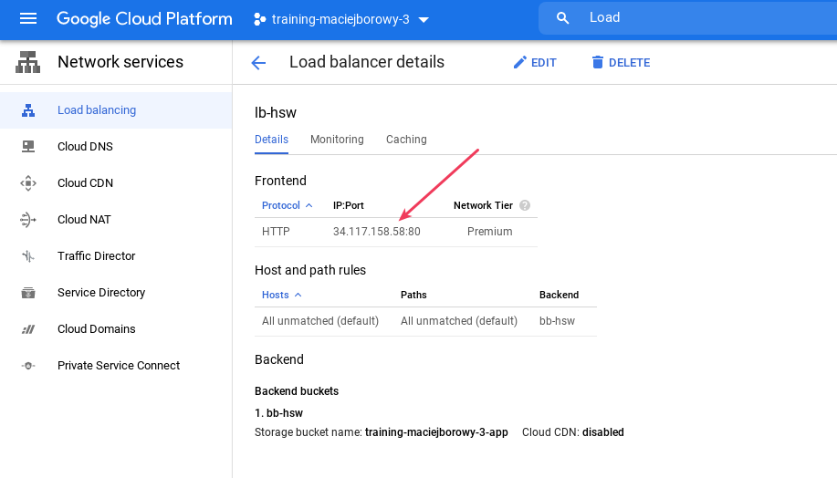

<br><br>
<br><br>
<br><br>

# Hosting statycznej aplikacji

W tym laboratorium zobaczysz jak hostować statyczną aplikację internetową na Cloud Storage.

---

## Krok 1: Sklonuj to repozytorium do Cloud Shell

1. Uruchom Cloud Shell
1. Wykonaj komendę:

   ```bash
   git clone https://github.com/cloudstateu/opl-g8-gcp
   ```

## Krok 2: Stwórz Storage Bucket

1. W Cloud Shell wykonaj:

   ```bash
   gsutil mb gs://<BUCKET_NAME>
   ```

## Krok 3: Wgraj pliki do Storage Bucket

1. Przejdź do katalogu `/app` i wykonaj komendę:

   ```bash
   gsutil cp -r . gs://<BUCKET_NAME>
   ```

## Krok 4: Udostępnij pliki publicznie

Domyślnie pliki w Cloud Storage Bucket nie są dostępne publicznie. Chcąc stworzyć publicznie dostępną stronę internetową musimy udostępnić wszystkie pliki w Bucket publicznie.

```bash
gsutil iam ch allUsers:objectViewer gs://<BUCKET_NAME>
```

## Krok 5: Skonfiguruj stronę internetową

Należy skonfigurować stronę internetową, żeby GCP wiedział, które pliki wyświetlać

```bash
gsutil web set -m index.html -e 404.html gs://<BUCKET_NAME>
```

- `-m` - Main Page Suffix - plik wyświetlany po wejściu na ścieżkę `/`
- `-e` - Not Found Page - plik wyświetlany, gdy zasób nie zostanie znaleziony

## Krok 6: Stwórz Load Balancer

Będziemy tworzyli Load Balancer w celu udostępnienia aplikacji pod statycznym adresem IP. Później można użyć go do podpięcia domeny lub skonfigurowania HTTP(s).

1. Stwórz nowy Load Balancer o nazwie `lb-hsw` z domyślnymi ustawieniami
1. Skonfiguruj Backend Bucket o nazwie `bb-hsw`. Wybierz Storage, który utworzyłeś wcześniej
1. Skonfiguruj Frontend IP and port. Nazwij go `ip-hsw`; resztę ustawień zostaw domyślnych.

## Krok 7: Poczekaj na skonfigurowanie Load Balancer

Poczekaj około 2-3 minuty aż Load Balancer i adres IP zostaną skonfigurowane.

## Krok 8: Przetestuj czy aplikacja jest dostępna

1. Wejdź w szczegóły Load Balancer o nazwie `lb-hsw` i pobierz adres IP:

   

1. Wyświetl stronę. Jeśli nadal otrzymujesz informację o braku zasobu do wyświetlenia odczekaj kolejne 1-2 minuty.
1. Spróbuj wyświetlić nieistniejący zasób np. `http://<WEBSTIE_IP>/123` i sprawdź czy otrzymasz zawartość strony `404.html`.

## Krok 9: Zaktualizuj aplikację

1. Stwórz nowy plik `test.html` z dowolną treścią HTML i wgraj aplikacje ponownie na Stroage Bucket (jak w kroku 3). **Nie otwieraj przeglądarki by przetestować wyświetlanie pliku**.
1. Zmień domyślne ustawienia cache dla pliku.

   ```bash
   gsutil setmeta -h "Cache-Control:private, max-age=60" gs://<BUCKET_NAME>/test.html
   ```

1. Sprawdź w przeglądarce czy strona została dodana. Wejdź na adres: `http://<WEBSITE_IP>/test.html`
1. Zaktualizuj plik `test.html` dodając dodatkowy ciąg znaków do wyświetlenia.
1. Wgraj aplikacje ponownie na Storage Bucket. **Nie otwieraj przeglądarki by przetestować wyświetlanie pliku**.
1. Zmień ustawienie cache dla pliku, ponieważ są resetowane po każdym upload.
1. Sprawdź w przeglądarce czy strona została zaktualizowana.

### O cache

Domyślne ustawienie cache w Cloud Storage są poprawne, ale na potrzeby lab zmniejszamy czas caching do 60 sekund, żeby szybciej zobaczyć efekty.

> Cloud Storage uses the default value of: `public, max-age=3600.`

Ustawienia to:

- `public` - zapytanie może być zcacheowane w dowolnym miejscu (na serwerze, na maszynie klienta) 
- `max-age=3600` - liczba sekund na jaką cacheowany jest zasób

---

**Koniec laboratorium**

<br><br>

<center><p>&copy; 2021 Chmurowisko Sp. z o.o.<p></center>
