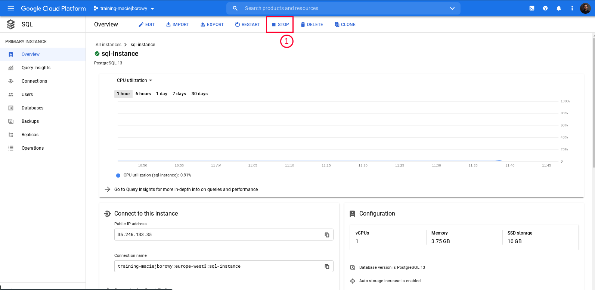
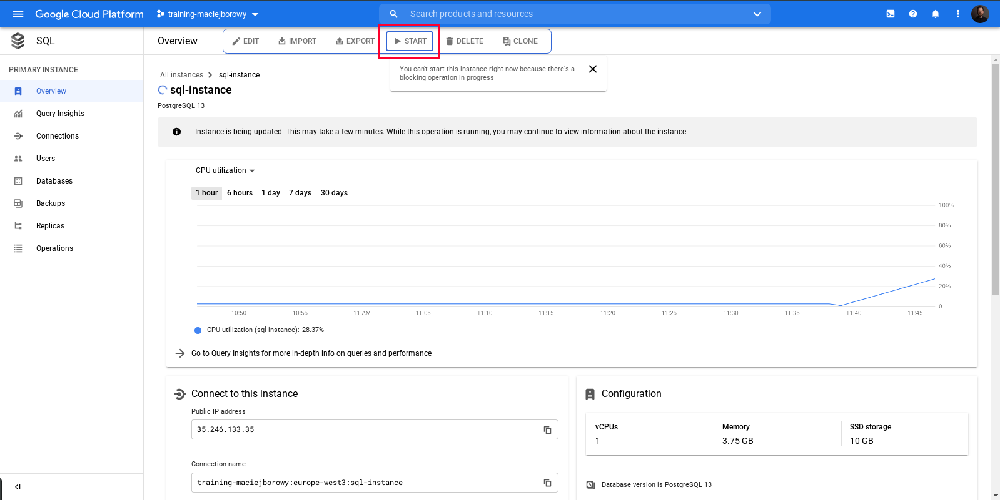
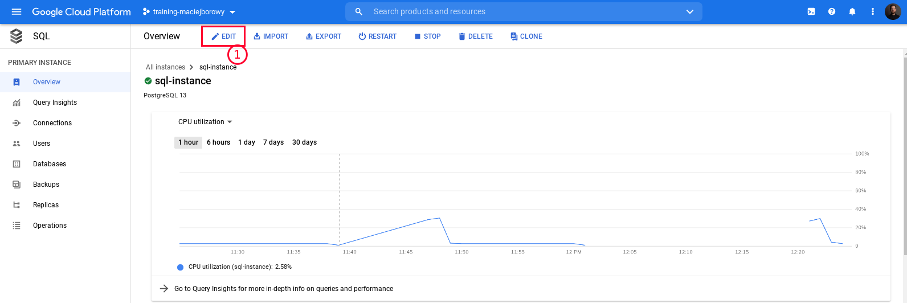
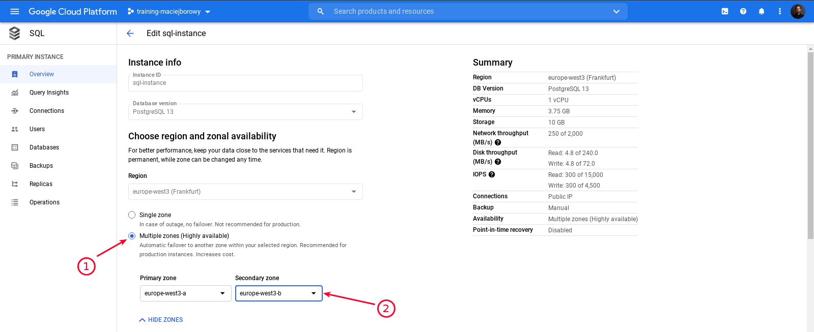
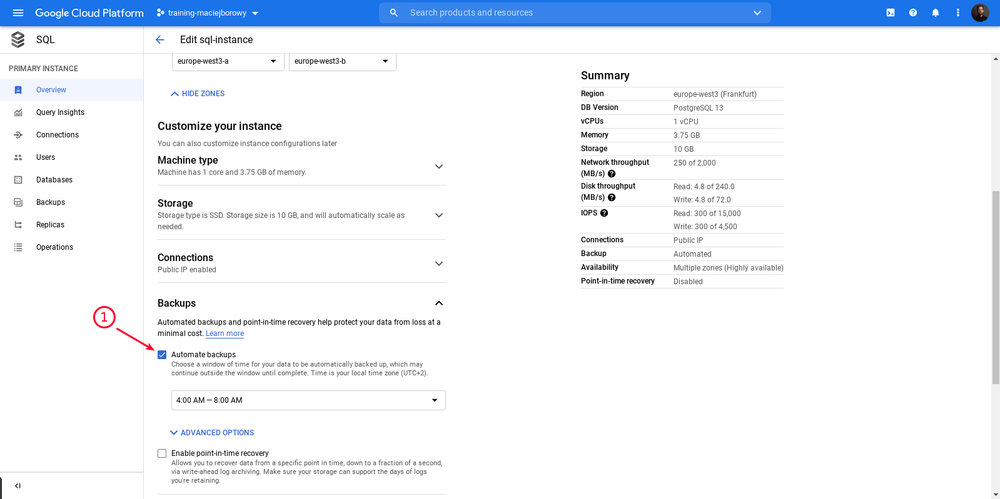
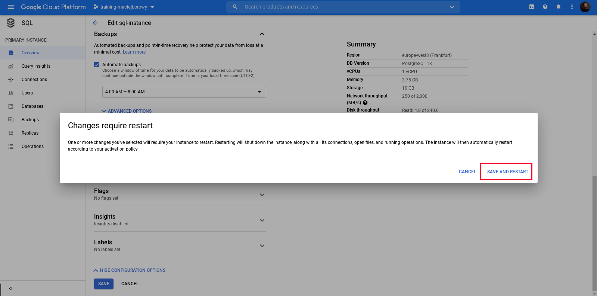
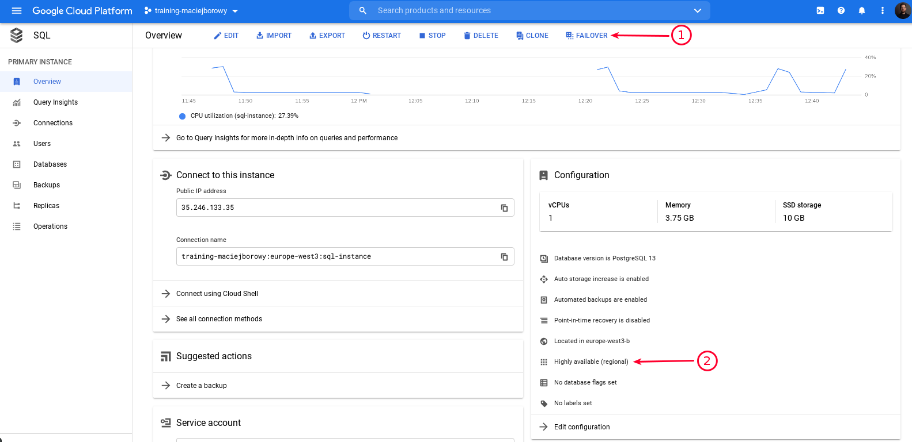
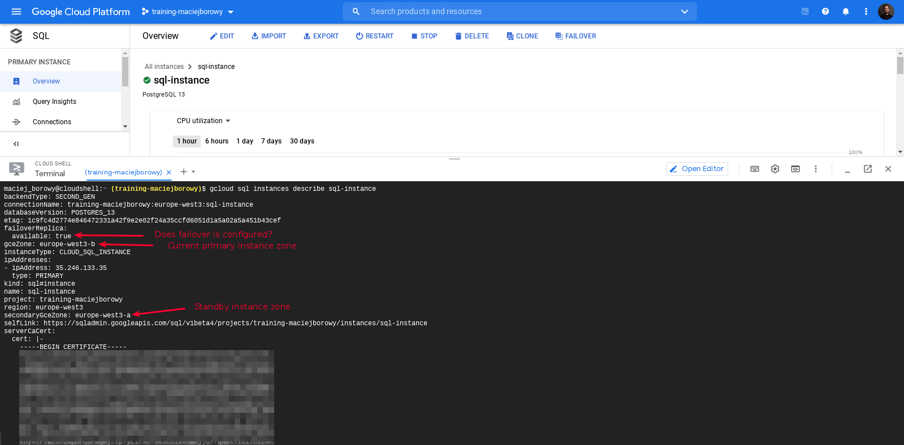
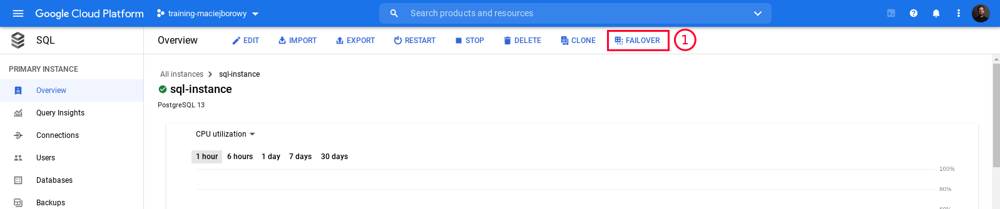

<br><br>
<br><br>
<br><br>

# Configuring Cloud SQL instance failover

## LAB Overview

In this lab you'll see how sample application behaves when it lose connection with Cloud SQL instance. Then you'll configure failover to switch to standby instance during database failure.

---

## Step 1: Query sample application

1. From Cloud Shell or your local machine run the following command:

   ```bash
   while true; do curl -s http://<APP_ENGINE_DOMAIN>/winners | cut --characters=1-105 && sleep 1 ; done
   ```

   It will request your application every second and return data it get from database.

   You should get the following output:

   ```bash
   {"status":"ok","data":[{"wid":1,"year":1928,"age":44,"name":"Emil Jannings","movie":"The Last Command"},{
   {"status":"ok","data":[{"wid":1,"year":1928,"age":44,"name":"Emil Jannings","movie":"The Last Command"},{
   {"status":"ok","data":[{"wid":1,"year":1928,"age":44,"name":"Emil Jannings","movie":"The Last Command"},{
   {"status":"ok","data":[{"wid":1,"year":1928,"age":44,"name":"Emil Jannings","movie":"The Last Command"},{
   ...
   ```

   Don't stop the loop and move to the next step.

## Step 2: Stop the Cloud SQL instance

1. On the Cloud SQL instance overview page click on "Stop"

   

1. Go back to the `curl` loop and check the output. After you stopped database you should see following output:

   ```bash
   {"status":"ok","data":[{"wid":1,"year":1928,"age":44,"name":"Emil Jannings","movie":"The Last Command"},{
   {"status":"ok","data":[{"wid":1,"year":1928,"age":44,"name":"Emil Jannings","movie":"The Last Command"},{
   {"status":"fail","error":"Connection terminated unexpectedly"}
   {"status":"fail","error":"Connection terminated unexpectedly"}
   {"status":"fail","error":"Connection terminated unexpectedly"}
   {"status":"fail","error":"Connection terminated unexpectedly"}
   {"status":"fail","error":"connect ECONNREFUSED /cloudsql/training-maciejborowy-3:europe-west3:sql-instanc
   {"status":"fail","error":"connect ECONNREFUSED /cloudsql/training-maciejborowy-3:europe-west3:sql-instanc
   {"status":"fail","error":"connect ECONNREFUSED /cloudsql/training-maciejborowy-3:europe-west3:sql-instanc
   {"status":"fail","error":"connect ECONNREFUSED /cloudsql/training-maciejborowy-3:europe-west3:sql-instanc
   ...
   ```

   As long as database is stopped (faking the database error) you'll get above output.

   Don't stop the loop and move to the next step.

## Step 4: Start the Cloud SQL instance

1. On the Cloud SQL instance overview page click on "Start"

   

1. Wait until application return correct database results.

   ```bash
   {"status":"ok","data":[{"wid":1,"year":1928,"age":44,"name":"Emil Jannings","movie":"The Last Command"},{
   {"status":"ok","data":[{"wid":1,"year":1928,"age":44,"name":"Emil Jannings","movie":"The Last Command"},{
   ...
   ```

## Step 5: Configure Failover

1. Go to instance configuration

   

1. Configure High Availablity (HA)

   

1. Configure Automated Backups (it is recommended by Google while enabling HA)

   

1. Save settings and restart instance

   

1. Verify if the failover is configured correctly

   
   

1. It will take some time to provision failover instance (2-3 minutes)

## Step 6: Initiate failover manually and observe application behavior

1. Click "Failover" button and trigger failover

   

1. Go back to the Cloud Shell and observe application.

   We expect to see similar output:

   ```bash
   {"status":"ok","data":[{"wid":1,"year":1928,"age":44,"name":"Emil Jannings","movie":"The Last Command"},{
   {"status":"ok","data":[{"wid":1,"year":1928,"age":44,"name":"Emil Jannings","movie":"The Last Command"},{
   {"status":"fail","error":"connect ECONNREFUSED /cloudsql/training-maciejborowy-3:europe-west3:sql-instanc
   {"status":"fail","error":"connect ECONNREFUSED /cloudsql/training-maciejborowy-3:europe-west3:sql-instanc
   {"status":"fail","error":"connect ECONNREFUSED /cloudsql/training-maciejborowy-3:europe-west3:sql-instanc
   {"status":"fail","error":"connect ECONNREFUSED /cloudsql/training-maciejborowy-3:europe-west3:sql-instanc
   {"status":"fail","error":"connect ECONNREFUSED /cloudsql/training-maciejborowy-3:europe-west3:sql-instanc
   {"status":"fail","error":"connect ECONNREFUSED /cloudsql/training-maciejborowy-3:europe-west3:sql-instanc
   {"status":"fail","error":"connect ECONNREFUSED /cloudsql/training-maciejborowy-3:europe-west3:sql-instanc
   {"status":"fail","error":"connect ECONNREFUSED /cloudsql/training-maciejborowy-3:europe-west3:sql-instanc
   {"status":"fail","error":"connect ECONNREFUSED /cloudsql/training-maciejborowy-3:europe-west3:sql-instanc
   {"status":"fail","error":"connect ECONNREFUSED /cloudsql/training-maciejborowy-3:europe-west3:sql-instanc
   {"status":"fail","error":"connect ECONNREFUSED /cloudsql/training-maciejborowy-3:europe-west3:sql-instanc
   {"status":"fail","error":"connect ECONNREFUSED /cloudsql/training-maciejborowy-3:europe-west3:sql-instanc
   {"status":"fail","error":"timeout expired"}
   {"status":"fail","error":"timeout expired"}
   {"status":"fail","error":"timeout expired"}
   {"status":"ok","data":[{"wid":1,"year":1928,"age":44,"name":"Emil Jannings","movie":"The Last Command"},{
   {"status":"ok","data":[{"wid":1,"year":1928,"age":44,"name":"Emil Jannings","movie":"The Last Command"},{
   {"status":"ok","data":[{"wid":1,"year":1928,"age":44,"name":"Emil Jannings","movie":"The Last Command"},{
   {"status":"ok","data":[{"wid":1,"year":1928,"age":44,"name":"Emil Jannings","movie":"The Last Command"},{
   ...
   ```

   As you see my application switched to standby instance after ~15 seconds.

---

**Koniec laboratorium**

<br><br>

<center><p>&copy; 2021 Chmurowisko Sp. z o.o.<p></center>
