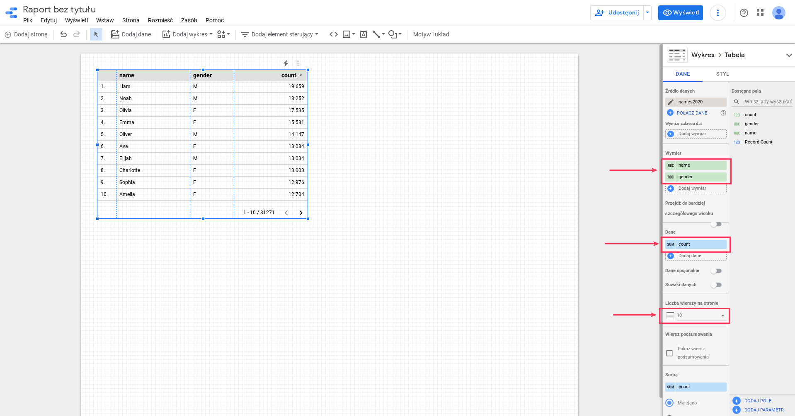
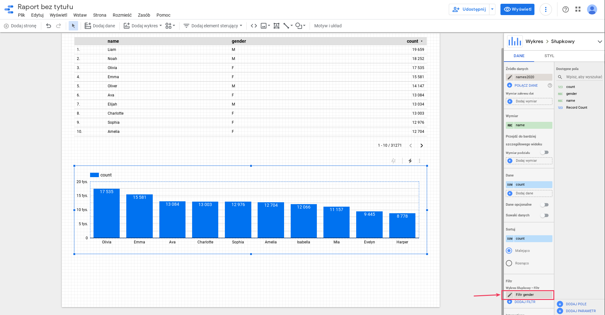
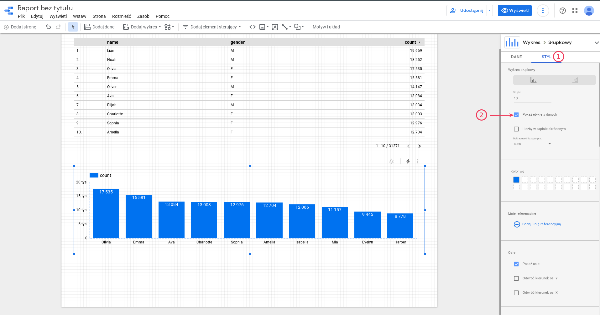
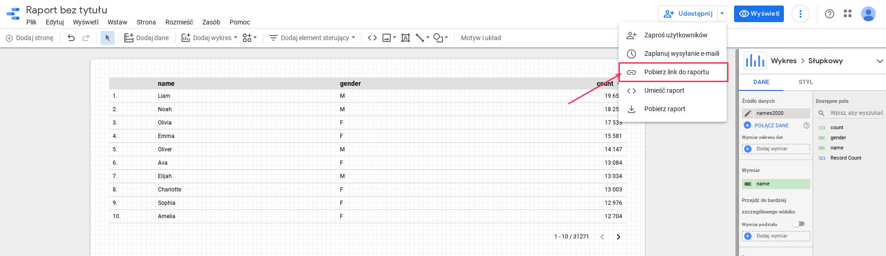
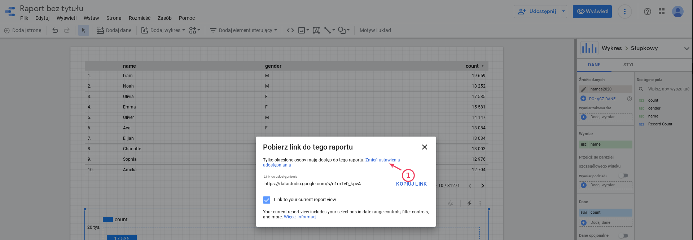
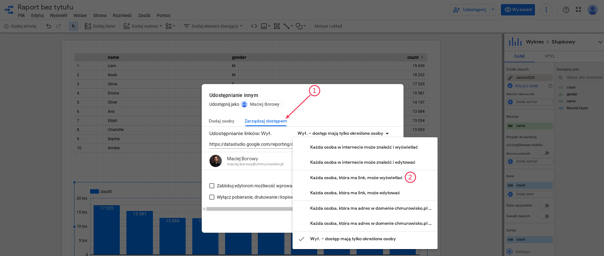
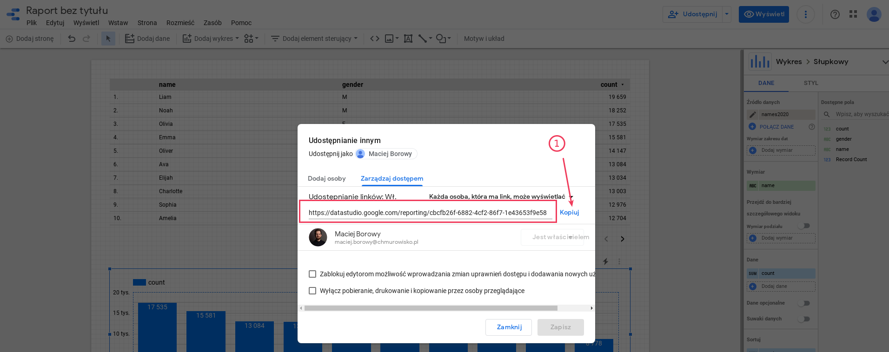
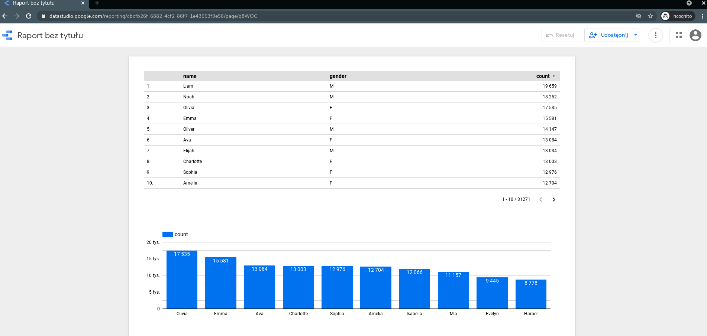

  
  
  

# Wizualizacja danych w Google Data Studio

W tym laboratorium zobaczysz jak zwizualizować dane przechowywane w BigQuery

---

## Krok 1: Przejdź do aplikacji Google Data Studio

Przejdź na stronę https://datastudio.google.com/. Usługa powinna wykryć, że jesteś zalogowany kontem studenta.

## Krok 2: Stwórz pusty raport

Wybierz opcję "Blank report" i wypełnij dane statystyczne. Po wysłaniu formularza ponownie kliknij "Blank report".

## Krok 3: Dodaj dane do raportu

Wybierz BigQuery, uwierzytelnij połączenie (jeśli Google o to poprosi). Znajdź swój projekt, zbiór danych `babynames` i tabele `names`. Dodaj dane do raportu.

## Krok 4: Zwizualizuj wybrane dane

1. Skonfiguruj raport, żeby wyświetlał tabelę 10 najpopularniejszych imion. Jeśli raport wyświetla mniej rekordów powiększ element raportu.

   

1. Dodaj wykres najpopularniejszych imion

   
   
   

## Krok 5: Udostępnij raport dla osób z linkiem

Wykonaj poniższe kroki, aby uzyskać link do raportu, który może zostać udostępniony każdej osobie.

   
   
   
   

Sprawdź czy możesz wyświetlić raport w trybie incognito.

   

---

**Koniec laboratorium**

  

&copy; 2021 Chmurowisko Sp. z o.o.

https://datastudio.google.com/
