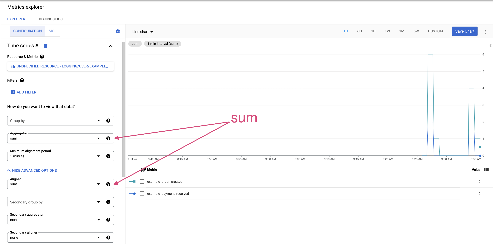

# Cloud Operations Sample

## Deploy application to App Engine

Create application for the first time using:

```bash
gcloud app deploy ./packages/dispatch.yaml ./packages/frontend/app.yaml ./packages/orders/app.yaml ./packages/payments/app.yaml
```

> :warning: Before you confirm deployment check whether `target url` matches URLs in code ([`frontend/index.js`](./packages/frontend/index.js#L25), [`frontend/index.js`](./packages/frontend/index.js#L40), [`payments/routes.js`](./packages/payments/routes.js#L13)). Depending on region where you provisioned App Engine it have different `REGION_ID` and thus `target url` ([explanation](https://cloud.google.com/appengine/docs/standard/python/how-requests-are-routed#urls)). 

## How to test application

1. Deploy application to App Engine
1. Visit main page of the application (`/`) and place order
1. Copy order ID
1. Make request to payments endpoint with order ID

### Sample Payments request

```bash
curl -X POST -d '{ "data": { "order": { "id": "<ORDER_ID>" } } }' -H 'Content-type: application/json' <APP_ENGINE_URL>/payments/
```

### Metrics Explorer configuration

To visualize ratio between users who want to attend event and those who actually paid for it create custom metrics and a monitoring dashboard.

Create two custom logs-based metrics for logs with message _"Order created"_ and _"Payment received"_. Then create a dashboard with following configuration:


